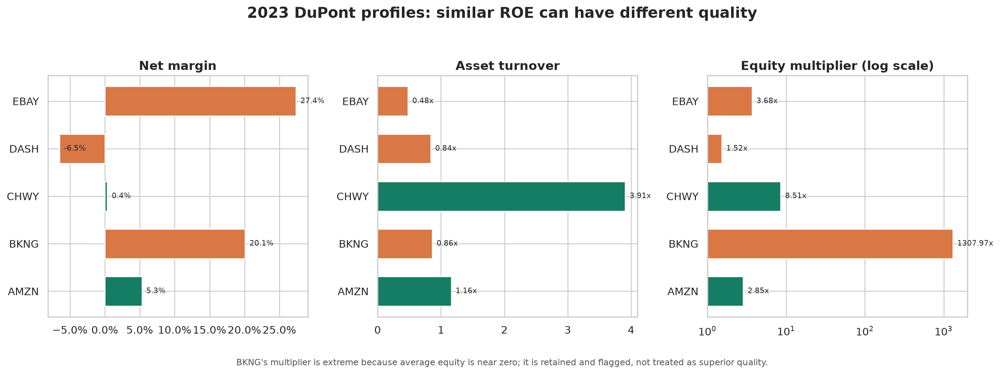
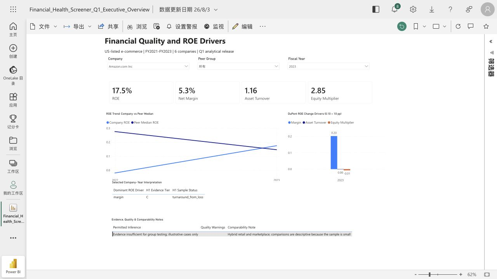

# Financial Health Screener

A reproducible SEC-to-Power BI research project that explains how e-commerce companies produce return on equity and, if the required evidence exists, tests whether leverage-driven improvements are less persistent than operating-driven improvements.

## Research Questions

**Q1-A. Financial quality:** Is ROE driven by net margin, asset turnover, or the equity multiplier? Can similar ROE outcomes have materially different financial quality?

**Q1-H1. Persistence:** Are leverage-driven ROE improvements less persistent one year later than operating-driven improvements?

**Conditional Q2/Q3:** Only after the formal event-coverage gate, study distress event paths and determine whether any supported signals qualify for a current peer screen.

The project does not provide investment recommendations, target prices, return predictions, or a black-box risk score.

## Current Status

Status: **A1 Unified Company & Event Census complete. A2 source-probe revalidation is next. Six-company work remains a B1 Pilot snapshot; Gate 1 and Gate 2 are pending.**

The frozen execution order is:

```text
A0E -> A1 -> A2 -> A3 -> Gate 1 -> B1 -> B2 -> B3 -> B4 -> B5 -> Gate 2
```

The repository currently contains:

- A completed 50-company A1 census with 40 Q1 candidates, satisfying the approximately 30-40 stopping range.
- Fourteen sourced event candidates, satisfying the approximately 10-15 A1 stopping range while leaving A3 verification fields blank.
- A reusable Amazon/eBay SEC source probe and a six-company accession-level evidence cache.
- A reproducible six-company, FY2021-FY2023 analytical Pilot with SQL marts, tests, notebooks, charts, and a one-page Power BI prototype.

These artifacts are retained as Pilot evidence. They are not the Gate 1 formal sample, the formal B4 minimum CV deliverable, or the B5 Portfolio Release v1.0.

## Pilot Scope

- Companies: AMZN, BKNG, CHWY, DASH, EBAY, ETSY
- Years: FY2021-FY2023
- Rows: 18 company-years
- Pilot peer groups:
  - Inventory-led E-commerce: AMZN, CHWY
  - Marketplace / Platform: BKNG, DASH, EBAY, ETSY
- SEC cache: 12 companyfacts/submissions artifacts
- Normalized evidence: 599 accession-level facts and 222 cutoff-eligible canonical selections

The six-company peer comparisons are descriptive examples only. The Pilot has zero eligible H1 transitions, but this does not determine the formal H1 Evidence Tier; that decision requires the A3 scan across the completed A1 candidate pool.

## Gate Status

- **Gate 1: pending.** A3 has not yet produced the evidence required to freeze Data Path, formal sample, years, peer groups, H1 Tier, canonical fields, and Power BI mart.
- **Gate 2: pending.** Blank event coverage is missing evidence, not evidence of infeasibility. A3 must verify real event-quarter coverage, filing dates, point-in-time feasibility, YTD cash-flow reconstruction, peer availability, and manual cost before applying Tier A/B/C thresholds.

## Method

```text
ROE = Net Margin x Asset Turnover x Equity Multiplier

Net Margin        = Net Income / Revenue
Asset Turnover    = Revenue / Average Assets
Equity Multiplier = Average Assets / Average Equity
ROE               = Net Income / Average Equity
```

Average assets and equity use consecutive fiscal-year-end balances. Metrics are invalidated when required balances are missing or average equity is nonpositive.

Exact three-factor Shapley decomposition attributes each valid annual ROE change to margin, asset turnover, and equity multiplier. The contributions reconcile exactly to the observed change. H1 eligibility retains the frozen positive-equity, positive-base-ROE, positive-improvement, valid-components, and observable-forward-year rules.

## Pilot Findings

- 11 of 18 Pilot company-years have valid average-balance DuPont metrics.
- Five Pilot transitions have valid Shapley decompositions.
- AMZN and CHWY illustrate that similar ROE can come from very different margin, turnover, and leverage profiles.
- BKNG illustrates why near-zero average equity can make ROE mechanically extreme and economically unstable.
- The Pilot cannot test H1 because it has zero eligible forward transitions.

Pilot analysis: [`docs/q1_analysis_report.md`](docs/q1_analysis_report.md)



## Power BI Pilot Prototype

The existing one-page Executive Overview consumes only `data/processed/q1_powerbi_mart.csv`. It demonstrates the required B5 interaction pattern but is not the formal B5 release because it uses the Pilot sample.

The page includes company, peer-group, and fiscal-year slicers; four DuPont KPIs; company versus peer-median ROE trend; Shapley change contributions; selected-year interpretation; and quality/comparability notes.



Reference Pilot export: [`powerbi/Financial_Health_Screener_Q1_Executive_Overview.pbix`](powerbi/Financial_Health_Screener_Q1_Executive_Overview.pbix)

Power BI Service Pilot report: [Financial Health Screener Q1 Executive Overview](https://app.powerbi.com/groups/me/reports/fb9d94b1-fc87-484a-9282-2895f48b80fa/4ffbaf6ac660aec51266?experience=power-bi)

## Repository Guide

| Path | Role |
| --- | --- |
| `data/reference/company_universe.csv` | Active A1 company census and Pilot flag |
| `data/reference/events.csv` | Active A1 event candidate census |
| `data/reference/q1_analysis_scope.csv` | Six-company B1 Pilot scope only |
| `data/raw/sec/` | Cached SEC companyfacts/submissions JSON and manifest |
| `data/normalized/financial_facts.csv` | Pilot annual accession-level SEC fact history |
| `data/processed/b1_pilot_coverage.csv` | Six-company coverage snapshot; not the A3 full-candidate report |
| `src/build_b1_pilot.py` | Rebuilds the current six-company Pilot evidence layer |
| `src/phase_a_evidence.py` | Pilot evidence and reusable A2 probe logic |
| `src/build_q1_v3_pipeline.py` | Rebuilds Pilot SQL marts |
| `sql/01_core_tables.sql` to `sql/07_q1_powerbi_mart.sql` | Pilot implementation of the frozen analytical method |
| `tests/` | Pilot accounting, evidence, and method contracts |
| `powerbi/` | Pilot report export, screenshot, notes, and reconciliation |

Legacy composite risk-ranking files remain labelled learning artifacts and are not part of the v3 method.

## Rebuild the Pilot

```bash
.venv/bin/python src/check_financial_statements.py
.venv/bin/python src/build_q1_release.py
.venv/bin/python -m unittest discover -s tests -p 'test_*.py' -v
```

## Formal Completion Criteria

- **B4 minimum CV deliverable:** only after A1, A2, A3, Gate 1, B1 revalidation, B2 formal expansion, and B3 formal marts pass their documented DoD.
- **B5 Portfolio Release v1.0:** formal B4 plus the reconciled single-page Power BI report, frozen PBIX reference, screenshot, README, CV bullet, and five-minute narrative.
- **Q2/Q3:** conditional; their existence and form are determined only by Gate 2 and Gate 3 evidence.

See [`docs/project_status.md`](docs/project_status.md), [`docs/release_closure_audit.md`](docs/release_closure_audit.md), and [`docs/limitations.md`](docs/limitations.md) for the current execution boundary.
