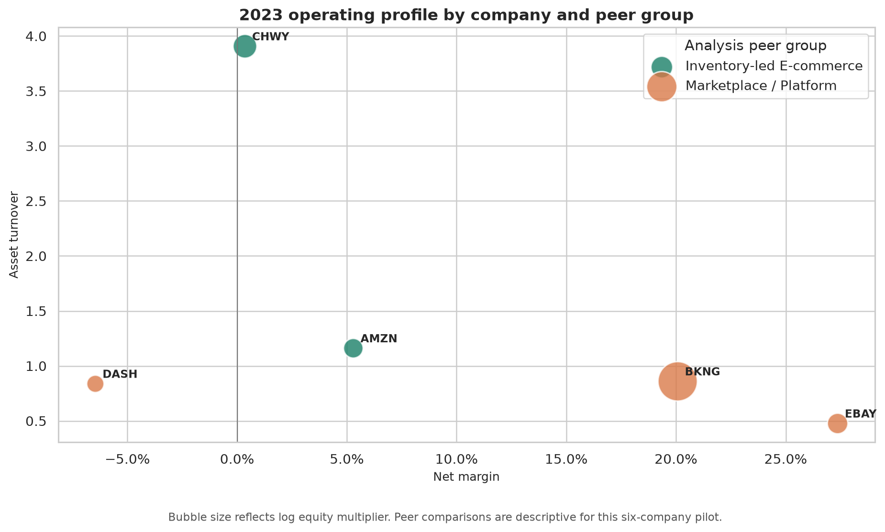
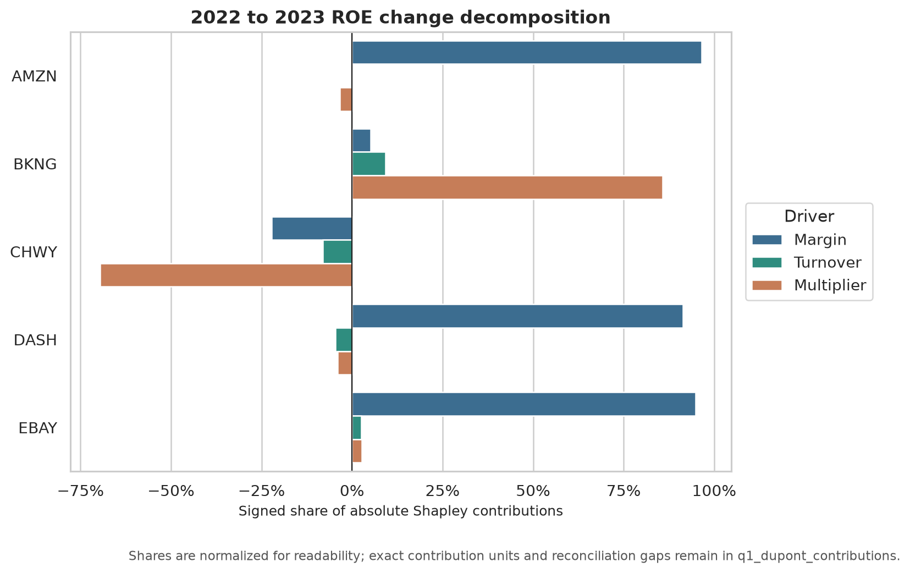
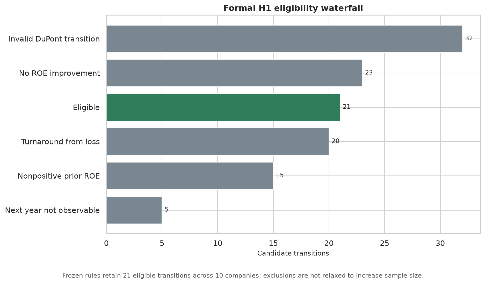

# Q1 Analysis Report

Analytical data as of: 2024-01-28
Pilot snapshot date: 2026-08-03

## Executive Summary

This six-company pilot supports the Q1-A proposition that similar ROE levels can reflect materially different financial mechanisms. It does not support a statistical test of H1.

The strongest paired case is AMZN versus CHWY in FY2023. AMZN produced 17.5% ROE from a 5.3% net margin, 1.16x asset turnover, and 2.85x equity multiplier. CHWY produced 11.8% ROE with only a 0.4% net margin, but 3.91x turnover and an 8.51x multiplier. Looking only at ROE would hide the difference between operating margin, asset intensity, and balance-sheet leverage.

BKNG provides the mandatory counterexample. Its 2023 calculated ROE is extreme because average equity is almost zero. The DuPont identity and Shapley reconciliation still work, but the ratio is mechanically unstable. The project retains the value, adds a warning, and does not interpret it as proportionally superior operating quality.

## Data Quality Results

- 18 of 18 expected company-year rows are present.
- 11 company-years have valid average-balance DuPont metrics.
- FY2021 metrics requiring average balances are unavailable because FY2020 balances are outside the dataset.
- ETSY FY2023 ROE is invalid because average equity is nonpositive.
- BKNG FY2023 and ETSY FY2022 receive near-zero-equity warnings.
- Gross profit is unavailable for BKNG and DASH under the current source dataset.
- Inventory is unavailable or not applicable for BKNG, DASH, EBAY, and ETSY.
- Chewy's latest restated comparative series is documented and selected.

## Q1-A: Financial Quality

### Case 1: AMZN and CHWY

| FY2023 metric | AMZN | CHWY |
| --- | ---: | ---: |
| ROE | 17.5% | 11.8% |
| Net margin | 5.3% | 0.4% |
| Asset turnover | 1.16x | 3.91x |
| Equity multiplier | 2.85x | 8.51x |

The two ROE values are close enough to invite comparison, but the business mechanisms are not. Amazon's result is primarily margin based, while Chewy's much thinner margin requires substantially higher turnover and a larger equity multiplier.

### Case 2: BKNG and EBAY

Both companies report strong positive margins in FY2023, but neither headline ROE should be read without quality warnings. BKNG's equity multiplier exceeds 1,300x because average equity is close to zero. EBAY's GAAP net income includes issuer-specific non-operating and one-off effects documented in the source mapping. Their ratios are useful for diagnosis, not as unqualified performance rankings.

## ROE Change Decomposition

Five FY2022-to-FY2023 transitions have valid exact Shapley decompositions:

- AMZN: improvement is operating-driven, dominated by margin recovery.
- BKNG: improvement is leverage-driven, dominated by the multiplier effect from the thin equity base.
- CHWY: ROE declines, mainly through a lower multiplier contribution, with margin and turnover also negative.
- DASH: ROE improves from a loss, dominated by margin, but remains a turnaround-from-loss case.
- EBAY: ROE improves from a negative prior ROE, dominated by margin, and remains a turnaround-from-loss case.

Every valid decomposition reconciles to the observed change in ROE within `1e-10`.

## H1 Result

Evidence Tier: **C**

Eligible transitions: **0**

The exclusion waterfall contains:

- 7 invalid prior/current DuPont transitions, mainly because FY2021 lacks opening balances.
- 3 turnarounds beginning from nonpositive ROE.
- 1 transition with no ROE improvement.
- 1 otherwise valid improvement without an observable next-year outcome.

No leverage-versus-operating persistence test is reported. BKNG's leverage-driven 2023 improvement is an illustrative case only because FY2024 is absent.

## Interpretation

The Pilot supports the narrower, decision-useful statement that ROE needs a driver and denominator diagnosis before it is compared across business models. It does not support the broader persistence hypothesis with the current sample and does not determine the formal H1 Evidence Tier.

That distinction is intentional. The Pilot provides reproducible metrics, auditable exclusions, useful company cases, and a clear next-data requirement while A2-A3 and the formal gates remain incomplete.

## Limitations

See [`limitations.md`](limitations.md). This report is analytical decision support and not investment advice.
