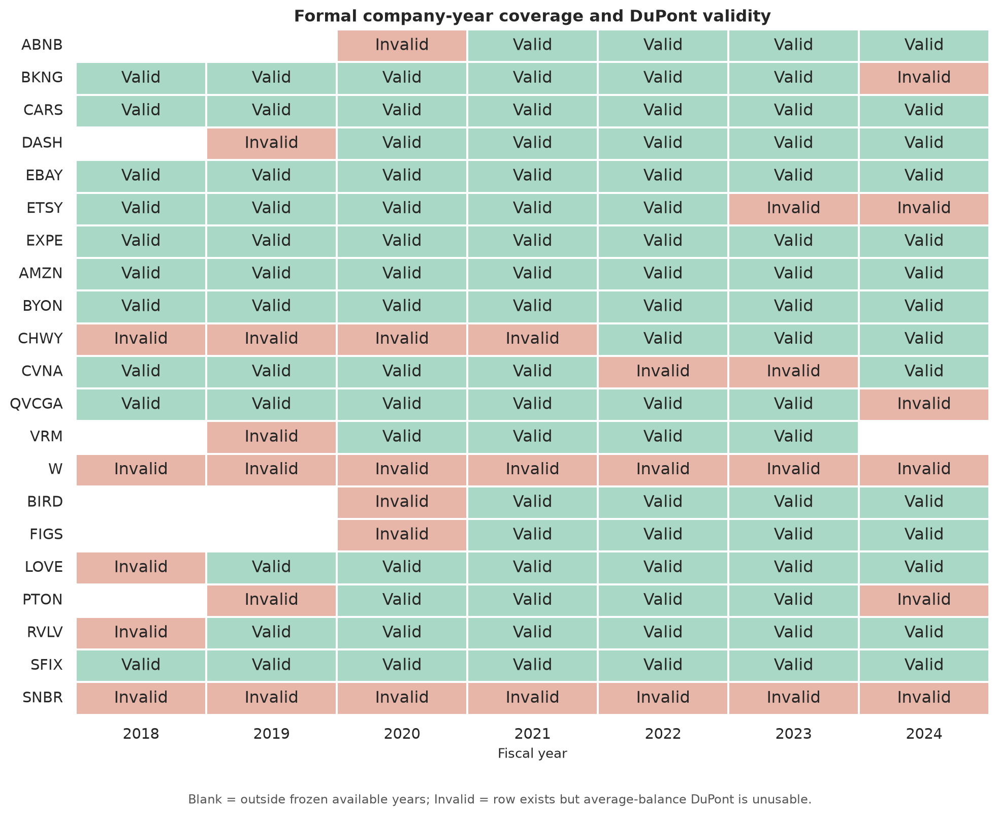
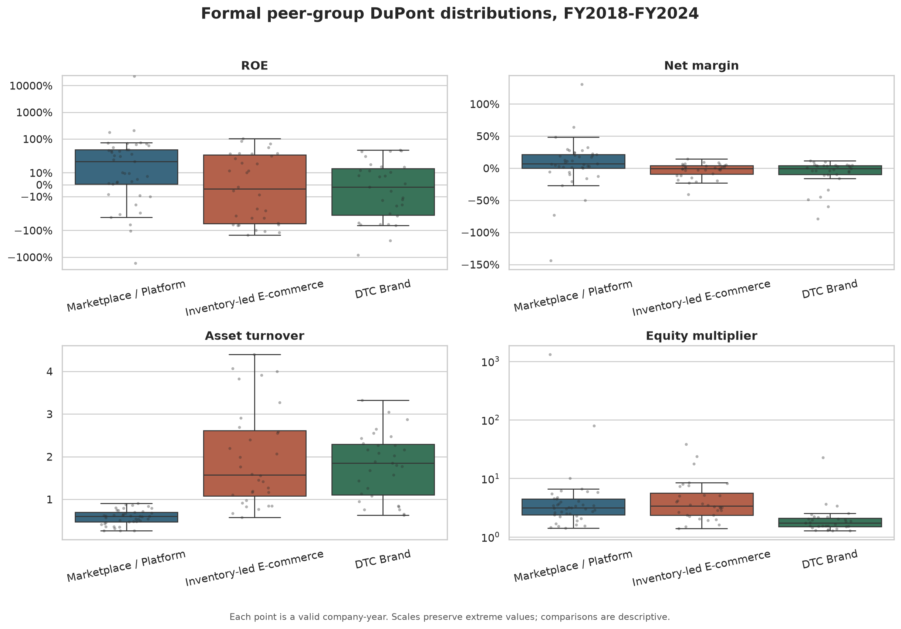
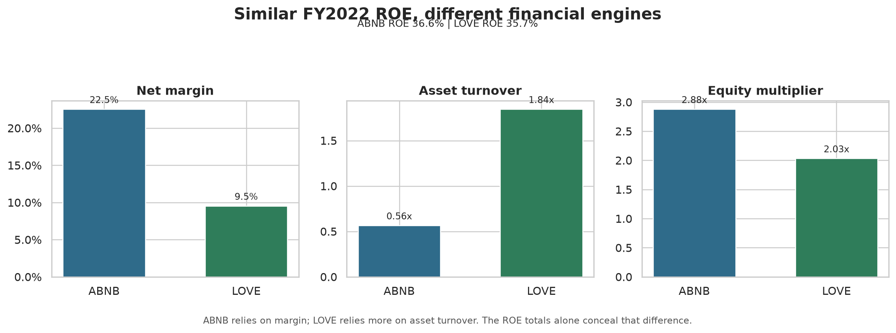
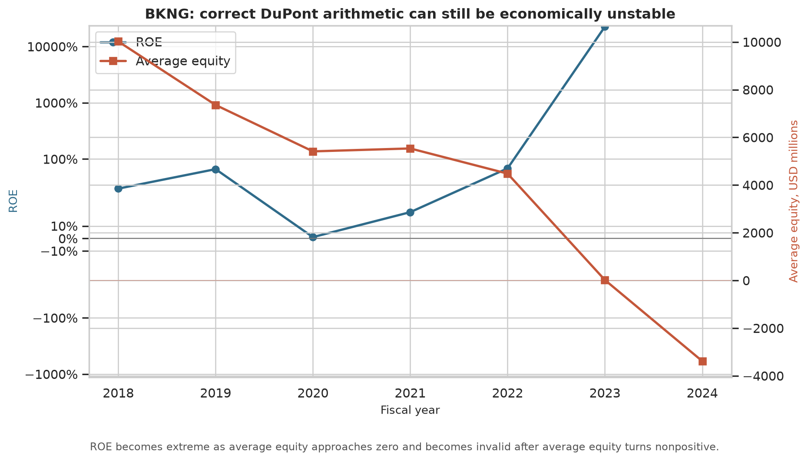
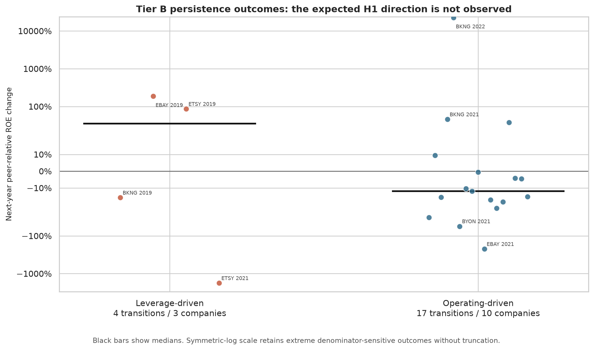
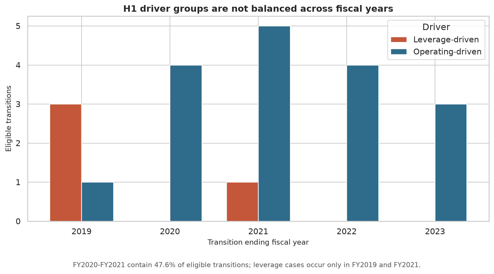

# Q1 Formal Analysis Report

Analytical data as of: **2026-08-05**

Release stage: **B4 Analytical Release**

## Scope and Questions

The frozen Path A panel contains 21 U.S.-listed e-commerce companies across Marketplace / Platform, Inventory-led E-commerce, and DTC Brand groups. It contains 137 available company-years from FY2018-FY2024; FY2017 is used only for opening balances.

Q1-A asks whether ROE is driven by net margin, asset turnover, or the equity multiplier, and whether similar ROE values conceal different financial quality. H1 asks whether leverage-driven ROE improvements are less persistent one year later than operating-driven improvements.

## Data Quality

- 104 company-years have valid average-balance DuPont metrics.
- Missing values remain null; ratios use protected denominators.
- Latest-restated annual facts are current as of the project run date and are not historical point-in-time observations.
- All source conflicts, candidate rejections, metric flags, and company overrides remain traceable to the B2 layer.
- DuPont and exact Shapley identities reconcile below `1e-10`.

## Q1-A: Financial Quality

Across valid company-years, Marketplace / Platform has the highest median ROE and net margin. Inventory-led and DTC companies generally depend more on asset turnover, but within-group dispersion is substantial. These are descriptive benchmarks for the frozen unbalanced panel, not industry estimates.

ABNB and LOVE are the clearest same-year example. Both generated roughly 36% ROE in FY2022. ABNB combined a 22.5% net margin with 0.56x turnover; LOVE combined a 9.5% margin with 1.84x turnover. Similar headline return therefore came from different economic engines.

BKNG is the required denominator counterexample. Positive but near-zero average equity makes mathematically correct ROE mechanically extreme; once average equity becomes nonpositive, ROE is invalidated rather than ranked.

## H1: Tier B Persistence Pattern

The frozen rules retain 21 eligible transitions across 10 companies. Only four transitions across three companies are leverage-driven; 17 transitions across 10 companies are operating-driven. This is Evidence Tier B, so only descriptive persistence patterns are permitted.

The observed direction does **not support H1**. Median next-year peer-relative ROE change is 35.2% for leverage-driven improvements and -11.9% for operating-driven improvements. Reversal rates are close, while individual paths are mixed: EBAY and ETSY FY2019 strengthen, whereas BKNG FY2019 and ETSY FY2021 reverse.

The result is not a rejection based on a balanced comparative panel. FY2020-FY2021 contain 47.6% of eligible transitions, and all leverage-driven cases occur in FY2019 or FY2021. Peer-relative outcomes reduce common-year effects but cannot remove this composition risk.

H1 would not be supported if leverage-driven improvements remain at least as persistent as operating-driven improvements across more independent companies and balanced years. The current Tier B pattern already fails to show the expected direction, but the sample is too small and imbalanced for validation.

## Evidence Boundary

- Company is the independent unit; transitions are repeated observations within companies.
- No company-clustered bootstrap is run because Gate 1 freezes Tier B, not Tier A.
- Turnarounds from nonpositive ROE are excluded from the main H1 sample and retained as separate audit cases.
- Near-zero and nonpositive equity are explicitly flagged; arithmetic validity does not imply economic stability.
- No investment recommendation, distress prediction, causal claim, or population-level industry inference is made.

The executed notebooks are [`02_data_quality.ipynb`](../notebooks/02_data_quality.ipynb) and [`03_q1_analysis.ipynb`](../notebooks/03_q1_analysis.ipynb).
